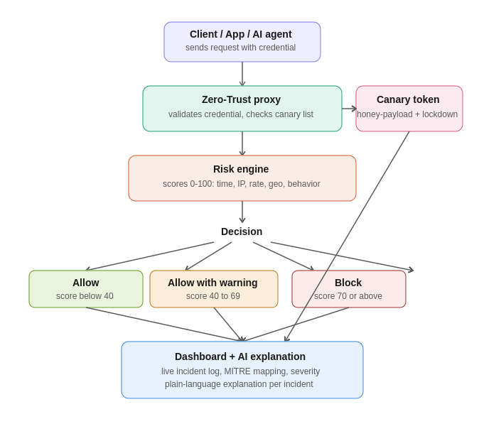

# 🛡️ CanaryGate

**A Zero-Trust reverse proxy with active canary-token deception, contextual risk scoring, and AI-assisted SOC monitoring — built for machine and AI-agent identities.**

> Instead of trusting a static API key indefinitely, CanaryGate evaluates every request against context — time, IP trust, request rate, geographic consistency, and behavior — and scores it for risk in real time. Leaked credentials are caught the moment they're used, not after the damage is done.

---

## 🎯 Why This Exists

Machine identities now outnumber human identities in most enterprise environments, yet most access control still relies on static API keys that are trusted forever once issued. CanaryGate demonstrates a working alternative: continuous, context-aware verification combined with active deception.

## ⚙️ How It Works

## 🧪 Security Testing

The proxy was tested against 14+ attack scenarios including SQL injection, path traversal, JWT tampering, header injection, oversized payloads, and concurrent-load race conditions. One genuine bug was found (a crash under concurrent requests) and fixed — full details in the project report.

## ⚠️ Honest Scope Note

This is a working prototype demonstrating real Zero-Trust and deception patterns, not a production-ready commercial product. Concepts used are established industry patterns (used commercially by CyberArk, Okta, Thinkst Canary); the original contribution here is the integration of all of them, plus AI-agent-aware policy, into a single self-built system.

## 📄 License

Built as an academic/internship project.
